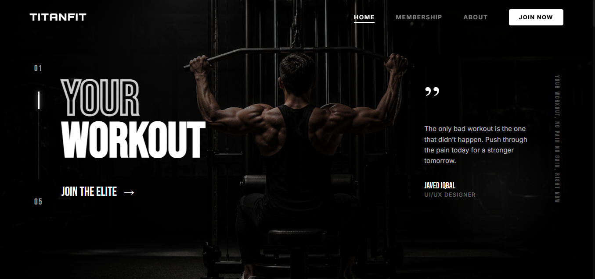

# Gym - Website Template



[](https://reactjs.org/)
[](https://vitejs.dev/)
[](https://www.framer.com/motion/)
[](https://lucide.dev/)

**Titan Fit** is a high-end, cinematic landing page designed for elite fitness brands and luxury gyms. It combines aggressive typography, minimalist monochrome aesthetics, and smooth, high-performance animations to create a world-class user experience.

---

## ✨ Key Features

- 🎞️ **Cinematic Hero Section**: Features a dynamic, auto-playing slider with a minimalist, high-impact design for mobile and a sophisticated scroll-driven experience for desktop.
- 💎 **Glassmorphism Registration**: A dedicated, conversion-focused "Join Now" page featuring a premium glass-styled form with zero-scroll optimization.
- 📱 **Mobile-First Responsiveness**: Every element is meticulously scaled and optimized for a "native app" feel on mobile devices.
- 🌑 **Premium Monochrome Aesthetic**: A curated palette of deep blacks, metallic grays, and high-contrast whites.
- ⚡ **High-Performance Animations**: Powered by **Framer Motion** for butter-smooth transitions and micro-interactions.
- 🗺️ **Routing Architecture**: Implemented with **React Router v7** for a seamless single-page application experience with dedicated sub-pages.

## 🛠️ Tech Stack

- **Framework**: React 19 (Vite)
- **Styling**: Vanilla CSS (Custom Variable Design System)
- **Animations**: Framer Motion
- **Icons**: Lucide React
- **Routing**: React Router v7

## 🚀 Getting Started

### Prerequisites

- [Node.js](https://nodejs.org/) (v18.x or higher recommended)
- [npm](https://www.npmjs.com/) or [yarn](https://yarnpkg.com/)

### Installation

1. **Clone the repository:**
   ```bash
   git clone https://github.com/your-username/titan-fit-luxury-gym.git
   ```

2. **Navigate to the project directory:**
   ```bash
   cd titan-fit-luxury-gym
   ```

3. **Install dependencies:**
   ```bash
   npm install
   ```

4. **Start the development server:**
   ```bash
   npm run dev
   ```

## 📸 Screenshots

### Desktop View


## 📄 License

This project is licensed under the **MIT License** - see the [LICENSE](LICENSE) file for details.

## 🤝 Contributing

Contributions are what make the open-source community such an amazing place to learn, inspire, and create. Any contributions you make are **greatly appreciated**.

1. Fork the Project
2. Create your Feature Branch (`git checkout -b feature/AmazingFeature`)
3. Commit your Changes (`git commit -m 'Add some AmazingFeature'`)
4. Push to the Branch (`git push origin feature/AmazingFeature`)
5. Open a Pull Request

---

Built with 🔥 by [Your Name]
